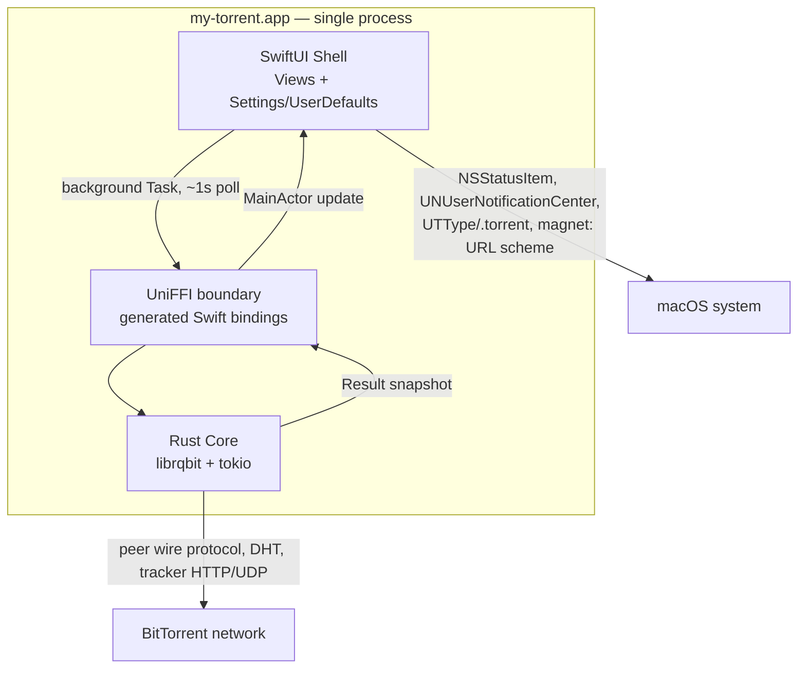

# Architecture Spine — my-torrent

## Design Paradigm

**Core-Shell (FFI-bound).** The Rust core (BitTorrent protocol engine) is the domain — it owns torrent/session state and all network I/O. SwiftUI is a thin shell — pure presentation, driving the core through a single generated boundary and holding no torrent-domain logic of its own. The two never talk except through that boundary.

| Layer | Namespace / directory |
| --- | --- |
| Core (domain) | `engine/` (Rust crate) |
| Boundary (generated, not hand-maintained) | UniFFI-generated Swift bindings, consumed from `MyTorrent/Generated/` |
| Shell (presentation) | `MyTorrent/Views/`, `MyTorrent/Models/` (thin wrappers only) |

## Invariants & Rules



### AD-1 — Single-process embedded core

- **Binds:** all
- **Prevents:** a builder spinning up the engine as a separate daemon/XPC process or sidecar, which would add idle resource overhead and unsigned-distribution signing friction
- **Rule:** the Rust engine is compiled as a library and linked in-process into the app via UniFFI. No IPC, sockets, or separate executables between engine and UI. [ADOPTED]

### AD-2 — Protocol engine built on librqbit

- **Binds:** engine/
- **Prevents:** a from-scratch peer-wire-protocol/DHT/tracker implementation, which would blow the timeline and risk-profile the Product Brief already flagged
- **Rule:** BitTorrent protocol behavior (peer wire protocol, DHT, tracker communication, `.torrent`/magnet parsing) is delegated to `librqbit`, built on `tokio`. App-specific logic (settings application, UI-facing snapshots) wraps it; it does not reimplement it. [ADOPTED]

### AD-3 — SwiftUI throughout, no AppKit

- **Binds:** MyTorrent/Views/
- **Prevents:** mixing SwiftUI and AppKit view code, which would fragment state management and styling across two paradigms
- **Rule:** all screens (main window, torrent detail, settings, menu bar) are built in SwiftUI. The menu-bar layer uses `MenuBarExtra` (macOS 13+), not an AppKit `NSStatusItem` + `NSPopover` pairing. [ADOPTED]

### AD-4 — Pull-based state sync, ~1s, only while a torrent is active

- **Binds:** MyTorrent ↔ engine/ boundary
- **Prevents:** one side assuming push callbacks and the other assuming polling; an always-on timer contradicting the near-zero-idle success criterion; a cold-launch deadlock where nothing polls because nothing is known to be active yet; a View-scoped timer that dies when the user closes the window; a torrent that stops being polled the moment it finishes downloading and starts seeding
- **Rule:**
  - The shell polls a single synchronous UniFFI snapshot function (e.g. `getAllTorrents() -> [TorrentStatus]`) on a ~1 second timer whenever at least one torrent is **active** (see Consistency Conventions for the active/inactive partition — Seeding counts as active).
  - **Bootstrap exemption:** on app launch, the shell performs exactly one unconditional snapshot call — exempt from the "poll only while active" gate — to discover torrents `librqbit` auto-resumed from its own session state. That call's result determines whether the recurring timer starts.
  - **Ownership:** the polling `Task`/timer is owned by an app-lifetime object (e.g. an `AppModel` created by `MyTorrentApp`), never by a View's `.task`/`.onAppear`/`.onDisappear`. Polling must survive every window being closed — that is the entire point of AD-7's accessory-app lifecycle.
  - **Completion detection:** the shell detects a torrent's transition into `Completed`/`Seeding` by diffing consecutive snapshots (previous-status vs. current-status per torrent id) and fires the local `UNUserNotificationCenter` notification on that transition. No separate "on complete" callback exists — this diffing is the only completion signal.
  - The timer stops entirely once a poll shows zero active torrents — that is what "idle" means for the near-zero-CPU requirement.
  - The core exposes no UniFFI callback/foreign-callback interfaces for state push. [ADOPTED]

### AD-5 — Split state ownership, one-directional

- **Binds:** all
- **Prevents:** both sides trying to own settings (double-bookkeeping, drift between a Rust-side config file and Swift `UserDefaults`), or the core reaching into macOS preference APIs
- **Rule:** the Rust core owns torrent/session state (via `librqbit`'s own resume-data mechanism). The Swift shell owns app settings (default save path, default seed duration) via native `UserDefaults`. Settings values flow one-directionally — Swift passes them as UniFFI call parameters when adding a torrent. The core never reads Swift preferences directly. **Seed duration is cumulative app-open time, not wall-clock time** — there is no background daemon (AD-1), so the countdown only advances while the app process is running; closing the app pauses it, relaunching resumes it. UI copy must say this explicitly (e.g. "seeds for 8 hours of app usage"), not imply wall-clock behavior. [ADOPTED]

### AD-6 — Typed errors across the FFI boundary

- **Binds:** engine/ ↔ MyTorrent boundary
- **Prevents:** ad-hoc string or integer error codes on one side that the other side doesn't parse consistently
- **Rule:** every fallible UniFFI function returns `Result<T, EngineError>`, mapped by UniFFI codegen to Swift `throws`. No error is surfaced as a bare string or numeric code. A Rust panic crossing the FFI boundary aborts the whole process (UI included) unless caught — every UniFFI-exposed function body is wrapped so a panic converts to `EngineError::Internal`, never an unhandled abort. [ADOPTED]

### AD-7 — Accessory app lifecycle; not sandboxed

- **Binds:** MyTorrent/ (app target config), packaging
- **Prevents:** the app quitting when the user closes the main window (which would silently kill AD-4's polling, menu-bar updates, and completion notifications — defeating the entire "runs quietly in the background" product concept); an implementer defaulting to macOS App Sandbox entitlements meant for App Store distribution
- **Rule:** the app runs as an `LSUIElement`/accessory app — closing all windows never terminates the process; the menu-bar (`MenuBarExtra`) is the persistent presence and the only way to quit is an explicit Quit action. The app is **not** sandboxed — this is non-App-Store, unsigned distribution (AD-10), so App Sandbox entitlements are unnecessary overhead, not a requirement. [ADOPTED]

### AD-8 — Mutation calls are consistency-blocking

- **Binds:** engine/ (pause/resume/remove) ↔ MyTorrent
- **Prevents:** a shell that re-polls immediately after a mutation and sees stale pre-mutation state (flicker, or a shell that mistakes "not yet applied" for "mutation failed" and retries)
- **Rule:** `pause_torrent`/`resume_torrent`/`remove_torrent` return only once `librqbit`'s internal state machine reflects the change — not merely once the request is enqueued. The shell may safely re-poll (or trust the mutation call's own return value) immediately after a successful call. [ADOPTED]

### AD-9 — FFI calls off the main thread

- **Binds:** MyTorrent/
- **Prevents:** a blocking Rust I/O call (e.g. adding a torrent, which touches disk/network) freezing the SwiftUI main thread
- **Rule:** every UniFFI call is invoked from a background `Task`/actor. Results are marshaled back to `@MainActor` before touching UI state. [ADOPTED]

### AD-10 — CI-built, unsigned release distribution

- **Binds:** build/release pipeline
- **Prevents:** a builder assuming Apple Developer Program signing/notarization exists, or manually-inconsistent release builds
- **Rule:** GitHub Actions (macOS runner), triggered on git tag, builds the app and packages an **unsigned** `.dmg`, published to GitHub Releases. No code signing, no notarization, no App Store — per the Product Brief's $0-budget constraint. [ADOPTED]

## Consistency Conventions

| Concern | Convention |
| --- | --- |
| Naming (Rust ↔ Swift) | Rust `snake_case` throughout the core; UniFFI codegen auto-converts to Swift `camelCase` at the boundary — never hand-write a bridging rename |
| Torrent identity | The BitTorrent **infohash**, lowercase hex — canonical for hybrid v1+v2 torrents, the v1 infohash is canonical — is the concept `Torrent.id` refers to everywhere. The UniFFI field itself may be named `info_hash`/`infoHash`; a thin `Models/` wrapper adds `Identifiable` conformance. The shell **never** computes/compares infohashes client-side (e.g. from a pasted magnet URI) — only IDs as returned by the engine are compared |
| Active / inactive partition | `active = {Downloading, Checking, Seeding}`; `inactive = {Paused, Error}`. This is what AD-4's polling gate tests — Seeding counts as active so seed-duration tracking and menu-bar accuracy don't silently stop the moment a download finishes. **`Completed-not-seeding` is not currently a reachable engine status** — see Deferred |
| Data & formats | Speeds in bytes/sec (integer) at the FFI boundary, computed by the engine from its own internally-tracked elapsed time — never assumed to equal the ~1s poll interval, which drifts under App Nap / FFI overhead / a slow tick. The shell formats to `MB/s` etc. for display only — no pre-formatted strings cross the boundary |
| Snapshot granularity | `getAllTorrents()` (AD-4) returns list-level fields only (progress, speeds, seed/leech counts, status) — **not** nested Files/Trackers/Peers. Torrent Detail (`2.2-torrent-detail`) is served by a separate `get_torrent_details(id) -> TorrentDetail` call, polled on its own ~1s cadence only while that window is open — keeps the hot, always-active list poll cheap |
| `add_torrent` parameter shape | `add_torrent(source: TorrentSource, ...)` where `TorrentSource` is a Rust enum over `{ Path(String), Bytes(Vec<u8>), Magnet(String) }` — pinned explicitly so the file-association handler (which may only have a short-lived URL) and the magnet handler don't each invent a different call shape |
| Errors | See AD-6 — typed `Result`/`throws` only, panics caught at the boundary |
| State mutation | All torrent-state mutation goes through the core via UniFFI calls (pause/resume/remove/add), consistency-blocking per AD-8 — the shell never mutates torrent state locally and reconciles later |

## Stack

| Name | Version |
| --- | --- |
| Rust | latest stable toolchain |
| librqbit | latest (crates.io; actively maintained, docs updated June 2026) |
| tokio | 1.x LTS (1.47.x until Sep 2026, or 1.51.x until Mar 2027) |
| UniFFI (mozilla/uniffi-rs) | latest (production-quality Swift bindings) |
| Swift | 6 — note: UniFFI has only *partial* Swift 6 (strict concurrency) support as of this research; see Deferred |
| SwiftUI / MenuBarExtra | macOS 13 (Ventura)+ |
| Xcode | latest stable |
| CI | GitHub Actions, macOS runner (arm64) |
| Target architecture | Apple Silicon (arm64) only — no Intel build, per Product Brief Platform Strategy |

## Structural Seed

```text
my-torrent/
  engine/                        # Rust crate — wraps librqbit, exposes UniFFI interface
    src/
      lib.rs                     # UniFFI-annotated public API (add_torrent, get_all_torrents, pause/resume/remove, ...)
      types.rs                   # TorrentStatus, TorrentFile, Tracker, Peer, EngineError — UniFFI-exposed shapes
    Cargo.toml
  MyTorrent/                     # SwiftUI app target (Xcode project)
    MyTorrentApp.swift           # App entry: WindowGroup (main window) + MenuBarExtra, accessory lifecycle (AD-7)
    AppModel.swift                # App-lifetime ObservableObject — owns the poll timer/Task (AD-4), survives all windows closing
    Views/
      MainWindowView.swift       # 1.1 — downloads list, toolbar, empty state
      TorrentDetailView.swift    # 2.2 — Files/Trackers/Peers tabs, separate window
      SettingsView.swift         # 3.1 — save location + seed duration, separate window
      MenuBarView.swift          # 4.1 — popover stats + actions
    Models/                      # thin Swift wrappers around UniFFI-generated types only — no domain logic
    Generated/                   # UniFFI-generated Swift bindings (build output, not hand-edited)
  .github/
    workflows/
      release.yml                # CI: build + package unsigned .dmg on tag (AD-10)
```

## Capability → Architecture Map

_This table lists capability-specific ADs only. ADs bound to "all" or a whole directory (AD-1, AD-5, AD-6, AD-7, AD-8, AD-9) apply everywhere regardless of whether a row cites them — e.g. `add_torrent` is still a background-thread (AD-9), typed-error (AD-6) call even though row 1 below doesn't repeat those IDs._

| Capability / Scenario | Lives in | Governed by |
| --- | --- | --- |
| 01 — Alex's Daily Download (zero-friction add) | `engine/` (`add_torrent`) + `MainWindowView` | AD-1, AD-2, AD-5 |
| 02 — Alex Inspects a Torrent | `TorrentDetailView` + FFI snapshot | AD-4, AD-6, AD-9 |
| 03 — Alex Sets Defaults Once | `SettingsView` + `UserDefaults` | AD-5 |
| 04 — Alex Glances at the Menu Bar | `MenuBarView` (`MenuBarExtra`) | AD-3, AD-4 |
| Main-window live stats (progress/speed/seed-leech) | `MainWindowView` polling loop | AD-4, AD-9 |
| File association (.torrent) / magnet URL scheme / completion notification | `Info.plist` + macOS system APIs | Deferred (exact entitlements) |
| Build & release | `.github/workflows/release.yml` | AD-10 |

## Deferred

- **Exact `Info.plist` entries** for `.torrent` UTType declaration and `magnet:` URL scheme registration — implementation detail, no cross-builder divergence risk (one file, one owner).
- **UniFFI interface definition mechanism** (UDL file vs. Rust proc-macros) — either works identically for this spine's purposes; pick at implementation time.
- **`librqbit`'s internal resume-data file location/format** — owned entirely by the library, not this project's decision to fix.
- **Row hover visual treatment; menu-bar icon design** — carried over as open visual-design questions from Phase 4 (WDS UX Design); not architecture concerns.
- **Per-file include/exclude selection; per-torrent seed-duration override** — explicitly out of v1 scope per Product Brief/UX Design decisions; revisit only if scope expands post-v1.
- **Logging/observability strategy** — not fixed. Low stakes for a single-user hobby app; revisit if debugging needs grow.
- **Swift 6 strict-concurrency adoption** — UniFFI's Swift 6 support is partial per current research (2026-07-27); revisit if strict-concurrency errors surface during implementation. Until then, target Swift 5 language mode if friction appears.
- **Epic/story breakdown** — this spine is at initiative altitude; breaking the 4 scenarios into implementable stories is the next step (`bmad-create-epics-and-stories`), not this document's job.
- **`Completed-not-seeding` engine status** — this row's original wording assumed a finished-but-not-seeding state would exist. Story 4.2 (completion notification) found, by reading `derive_status` (`engine/src/lib.rs`) and its `derive_status_covers_every_state` unit test, that the engine has exactly 5 statuses (`checking`, `paused`, `error`, `downloading`, `seeding`) — a finished torrent maps straight to `seeding`, with no intermediate "completed" state. This state only becomes reachable once a seed-duration-enforcement feature (stopping seeding after the Story 3.2 setting's duration elapses) is built — not scheduled on the current roadmap as of this writing. Revisit this row and Story 4.2's own completion-detection logic (`AppModel.detectCompletionsAndNotify`, which currently treats "transition into seeding" as the sole completion signal) together when that feature is planned.
